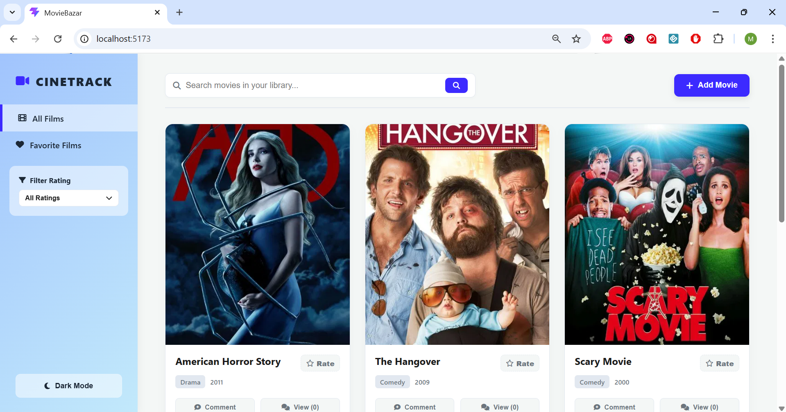
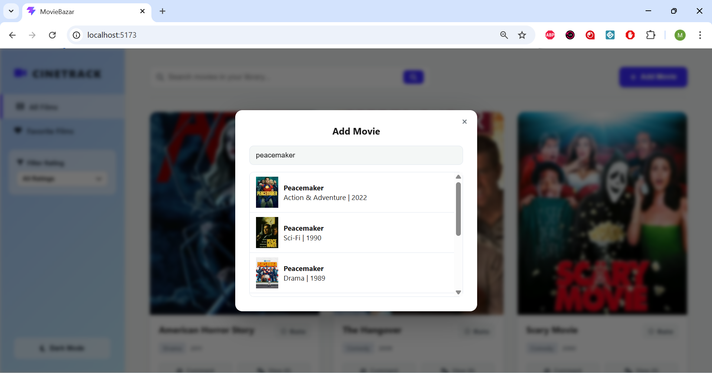
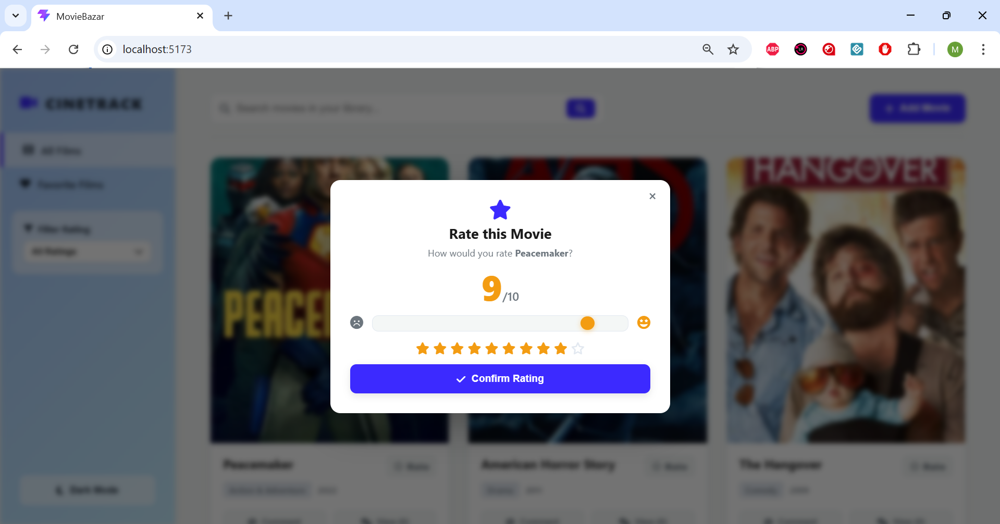
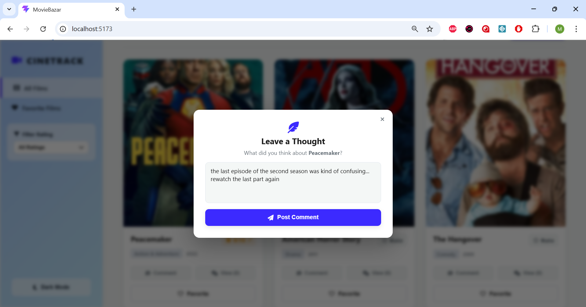
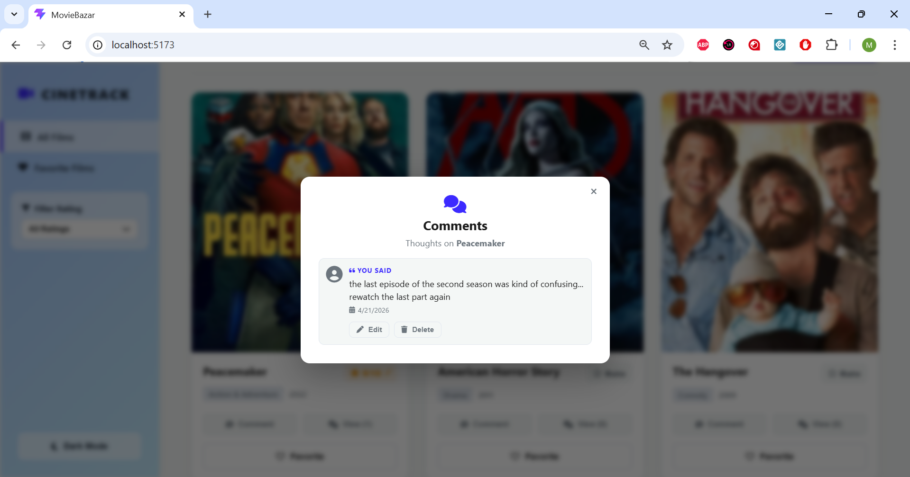
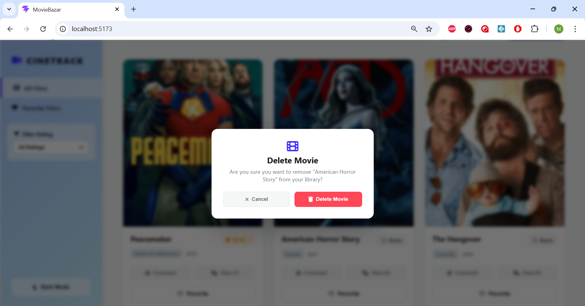
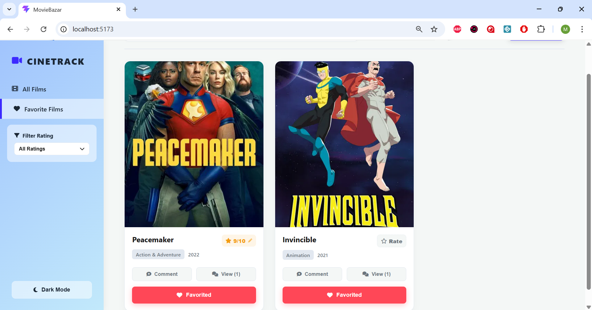
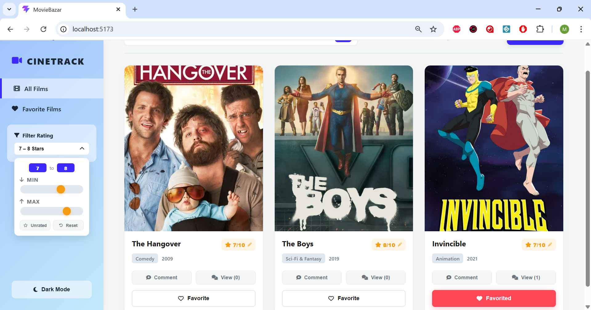
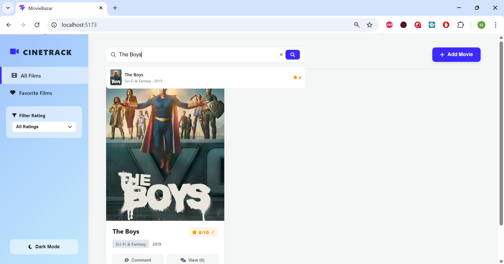
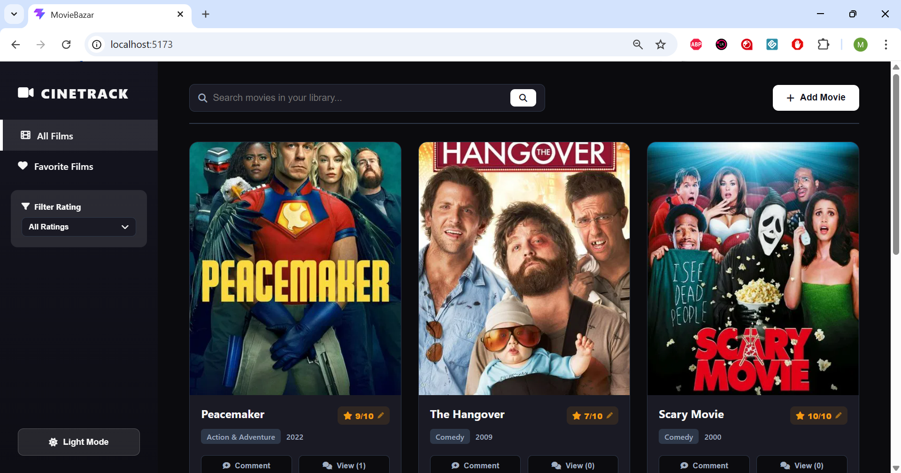

# Laboratory Work Nr. 6

## Description

CineTrack is a client-side movie tracking web application built with React. Users can build and manage a personal library of movies, rate them, leave comments, and filter their collection in various ways. All data is persisted in the browser using localStorage so the library survives page refreshes.

---

## App Flows

### Adding a Movie
The user clicks the **Add Movie** button in the top bar. A modal appears with a search input that queries the TMDB API in real time. Results show the poster, title, genre, and year. The user clicks a result to add it to their library.

### Deleting a Movie
A delete button appears on the movie poster on hover. Clicking it triggers a confirmation popup before the movie is permanently removed.

### Rating a Movie
Each movie card has a **Rate** button. Clicking it opens a modal with an interactive slider (1–10) and a live star preview. Once confirmed the rating is saved and displayed on the card. The rating can be edited at any time.

### Commenting
Each card has a **Comment** button that opens a modal where the user types and submits a thought. Comments are saved per movie. The **View** button opens a separate modal listing all comments with options to edit or delete each one (with confirmation).

### Favorites
Any movie can be marked as a favorite using the **Favorite** button on the card. The sidebar nav includes a **Favorite Films** tab that filters the grid to show only favorited movies.

### Filtering by Rating
The sidebar contains a **Filter Rating** panel with two range sliders for min and max rating. The user can filter to any range from 1–10, view only a specific score, or show only unrated movies. The label updates dynamically to reflect the active filter.

### Searching
The top bar search field shows a live dropdown of matching movies from the library as the user types. The grid itself only updates after the user presses Enter or clicks the search button. Clicking a dropdown suggestion also triggers the search. A clear button resets the search.

### Dark Mode
A toggle in the sidebar switches between light and dark themes. The preference is saved in localStorage.

### Home Reset
Clicking the **CINETRACK** logo resets all active filters, clears the search, and returns to the full movie grid.

---

## Client Requirements

| Requirement | Status |
|---|---|
| Entities that can be manipulated (add / remove / like / filter) | Movies — add, delete, favorite, filter by rating and tab |
| Custom theme and style | Custom CSS with CSS variables, no UI library used |
| Light and dark version | Implemented via `.dark-theme` class toggled on `body` |
| Accessible via public link | Hosted — see Demo section |

---

## Dev Requirements

| Requirement | Status |
|---|---|
| Front-end framework | React (Vite) |
| Runtime state | React `useState` and `useRef` throughout all components |
| Browser-persisted state | `localStorage` for movies and theme preference |
| Git history | Committed incrementally per feature |
| Hosted on static hosting | GitHub Pages — see Demo section |

---

## Project Structure

```
src/
├── components/
│   ├── AddMovieModal.jsx
│   ├── CommentModal.jsx
│   ├── ConfirmModal.jsx
│   ├── MovieCard.jsx
│   ├── MovieGrid.jsx
│   ├── Pagination.jsx
│   ├── RatingModal.jsx
│   ├── Sidebar.jsx
│   ├── TopBar.jsx
│   └── ViewCommentsModal.jsx
├── constants/
│   └── tmdbGenres.js
├── hooks/
│   ├── useApiSearch.js
│   └── useMovies.js
├── App.jsx
├── main.jsx
└── style.css
```

---

## Features Overview

### Movie Library Grid


### Add Movie Modal (TMDB Search)


### Rating Modal


### Comment Modal


### View Comments Modal


### Delete Confirmation


### Favorites Tab


### Rating Filter with Range Sliders


### Search with Dropdown


### Dark Mode


---

## Tech Stack

- **React** — UI framework
- **Vite** — build tool and dev server
- **TMDB API** — movie search and metadata
- **localStorage** — persistent browser storage
- **Font Awesome** — icons
- **CSS custom properties** — theming system

---

## Demo

> [CineTrack — Live Demo](https://mariaelenabotnari.github.io/tum-web-lab-6/)